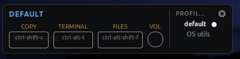
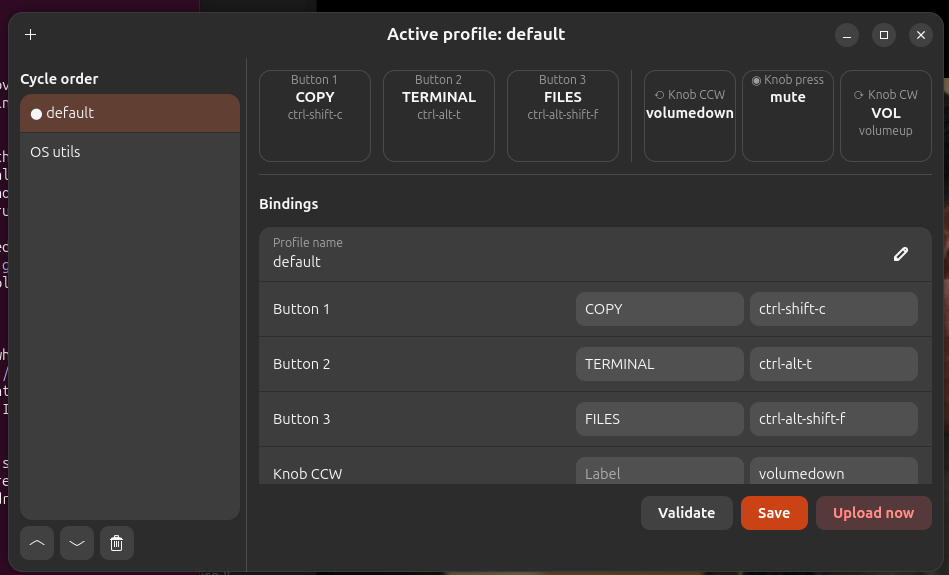

# Macropad Layer Manager

Profile ("layer") manager for CH57x-based **3-key + 1-knob** USB macropads
(VID:PID `1189:8890`) on Ubuntu 24.04+ / GNOME.

A single `Super+Q` press cycles to the next profile and re-flashes the device,
so the same three keys can be copy/paste shortcuts while coding and media
controls the rest of the time. An always-present desktop widget shows what the
keys currently do.

<p align="center">
  
</p>

This is a **companion to [`ch57x-keyboard-tool`](https://github.com/kriomant/ch57x-keyboard-tool)**,
not a replacement — all writing to the device is done by shelling out to that
CLI, and profiles are plain `ch57x-keyboard-tool` config files.

---

## Components

| Component | What it is |
|---|---|
| **HUD** (`macropad-hud@flanshaw.org`) | GNOME Shell extension: compact always-on-screen widget, bottom-left |
| **`macropad-manager`** | GTK4/libadwaita GUI for editing, validating and uploading profiles |
| **`macropad-cycle`** | CLI that switches profile and flashes the device — what `Super+Q` runs |
| **`macropad-status`** | CLI that prints the current state as JSON (consumed by the HUD) |
| **`macropad-window`** | CLI that drives window focus from the knob, via the HUD extension |
| **`macropad-daemon`** | systemd `--user` oneshot that re-flashes the active profile at login |

The HUD reads state and profiles straight from disk and watches them for
changes, so the GUI does not need to be running for anything else to work.

### The HUD

The friendly **label** sits above each key (`COPY`, `TERMINAL`, `FILES`, `VOL`)
and the raw **binding** inside the keycap (`ctrl-shift-c`, `ctrl-alt-t`, …).
The active profile is named top-left and marked with a dot in the list. Click a
profile name to switch to it immediately; click the gear to open the editor.

### The editor



The diagram across the top mirrors the HUD. Below it, each slot has a **Label**
field and a **Binding** field. The sidebar is the `Super+Q` cycle order —
reorder it with the arrows, add with **+**, remove with the bin.

---

## Requirements

- Ubuntu 24.04+ with GNOME (tested on GNOME Shell 50, Wayland)
- Python 3.11+
- `ch57x-keyboard-tool` on `PATH` — install with
  `cargo install ch57x-keyboard-tool` or grab a release binary
- PyGObject with GTK 4 and libadwaita (`python3-gi`, `gir1.2-adw-1` — present by
  default on Ubuntu GNOME)
- `pipx` (`sudo apt install pipx`)

### Device permissions

Uploading writes to the USB device directly, which needs a udev rule — without
it every upload fails with a permissions error unless run as root:

```bash
echo 'SUBSYSTEM=="usb", ATTR{idVendor}=="1189", ATTR{idProduct}=="8890", MODE="0666"' \
  | sudo tee /etc/udev/rules.d/99-ch57x-macropad.rules
sudo udevadm control --reload-rules && sudo udevadm trigger
```

Replug the macropad afterwards.

---

## Install

```bash
git clone https://github.com/flanshaw/macropad.git
cd macropad
./install.sh                # or: ./install.sh '<Super>F9' for a different hotkey
```

The installer pipx-installs the package, installs and enables the systemd user
unit, copies the GNOME Shell extension into place and enables it, and registers
the `Super+Q` custom keybinding via `gsettings`.

> **Log out and back in afterwards.** GNOME Shell only scans for extensions at
> session start, so the HUD will not appear until you do. Everything else works
> immediately.

---

## Usage

- **`Super+Q`** — cycle to the next profile. Works from any application and
  shows a desktop notification naming the profile that was loaded.
- **HUD** — click a profile to jump straight to it; click ⚙ to open the editor.
- **`macropad-manager`** — the GUI. Each binding row has a **Label** field
  (shown by the HUD) and a **Binding** field (the actual key). Buttons:
  - *Validate* — runs `ch57x-keyboard-tool validate` and shows the result inline
  - *Save* — writes the profile YAML
  - *Upload now* — flashes the edited profile immediately for testing
- **`macropad-cycle --set media`** — jump to a named profile from a script.
- **`macropad-cycle --restore`** — re-flash the active profile (run at login).
- **`macropad-status`** — print active profile, bindings and labels as JSON.
- **`macropad-window next|prev|overview`** — move window focus (see below).

Run `ch57x-keyboard-tool show-keys` for the list of valid binding names — note
that media keys are `prev` / `play` / `next`, not `prevsong` and friends.

### Switching windows with the knob

The `BT GM CL` profile uses the knob to walk between open windows: rotate to
move focus one window at a time, press to toggle the Activities overview.

`alt-tab` cannot do this. The macropad releases every modifier between detents,
so GNOME's switcher — which needs Alt held down — just flips between the two
most recent windows however far you turn. Instead:

```
knob CCW   -> ctrl-alt-shift-f9   ┐   GNOME custom      ┐  macropad-window   ┐  D-Bus to the
knob press -> ctrl-alt-shift-f10  ├─> keybindings       ├─ prev/overview/    ├─ HUD extension,
knob CW    -> ctrl-alt-shift-f11  ┘                     ┘  next              ┘  which moves focus
```

The extension does the switching because on Wayland only GNOME Shell may move
focus between windows. It orders windows by creation, not most-recently-used,
so a full turn visits every window once instead of oscillating between two.

`install.sh` registers those three chords as hidden hotkeys. To use the knob
this way in another profile, set its `ccw` / `press` / `cw` to the same chords.

---

## Configuration

Everything lives in `~/.config/macropad-manager/`:

```
state.json      {"active_index": 0, "order": ["default.yaml", "media.yaml"]}
hud.json        {"stacking": "top", "font_delta": 2}
profiles/
    default.yaml
    media.yaml
```

`hud.json` is read live — changes apply within ~250ms, no restart:

| Key | Values | Meaning |
|---|---|---|
| `stacking` | `top` (default) | Floats above windows, hides for fullscreen apps |
| | `desktop` | Below all windows, on the desktop itself |
| `font_delta` | integer, default `2` | Pixels added to every HUD font (may be negative) |

See [docs/configuration.md](docs/configuration.md) for the full reference.

### Profile format

Profiles are ordinary `ch57x-keyboard-tool` configs, so they stay usable
directly (`ch57x-keyboard-tool upload < profiles/default.yaml`). Display labels
live under an extra `labels:` key, which the CLI ignores:

```yaml
model: ch57x-2
orientation: normal
rows: 1
columns: 3
knobs: 1
layers:
  - buttons:
      - [ctrl-shift-c, ctrl-alt-t, ctrl-alt-shift-f]
    knobs:
      - ccw: volumedown
        press: mute
        cw: volumeup
labels:
  button1: COPY
  button2: TERMINAL
  button3: FILES
  knob_cw: VOL
```

---

## Documentation

| Document | Contents |
|---|---|
| [docs/architecture.md](docs/architecture.md) | How the pieces fit together and why |
| [docs/configuration.md](docs/configuration.md) | Every config file and field |
| [docs/development.md](docs/development.md) | Working on the code, and the GNOME reload rules |
| [docs/troubleshooting.md](docs/troubleshooting.md) | When something does not work |
| [docs/spec.md](docs/spec.md) | The original design spec |

---

## Repository layout

```
src/macropad_manager/       Python package
    core.py                 state, profile YAML, ch57x-keyboard-tool wrapper
    gui.py                  GTK4/libadwaita editor
    cycle.py                macropad-cycle entry point
    status.py               macropad-status entry point
    window.py               macropad-window entry point
extension/                  GNOME Shell extension (GJS)
    macropad-hud@flanshaw.org/
systemd/                    user unit for login restore
docs/                       documentation
install.sh                  one-shot installer
```

---

## Known limitations

- **GNOME/Wayland only.** Global hotkeys go through GNOME's custom keybinding
  mechanism, and the HUD is a GNOME Shell extension.
- **No chorded keys** (key1+key2 together) — a firmware limitation of the
  device, not something this app can add.
- **Editing `extension.js` requires a re-login.** GNOME 50 removed the
  `ReloadExtension` D-Bus method and Wayland cannot restart the shell in place.
  See [docs/development.md](docs/development.md).
- The HUD renders one knob, so it shows whichever knob action carries a label.
- **Knob window switching walks the current workspace only**, and needs the HUD
  extension enabled — the knob's hotkeys are inert without it.

---

## License

[MIT](LICENSE)
